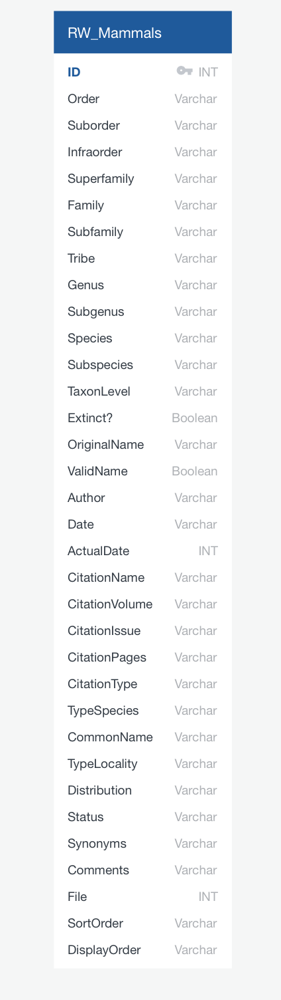
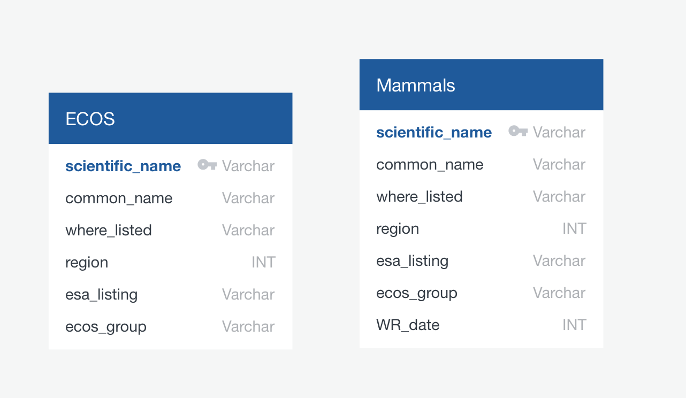

# ETL- Project Proposal
Demonstration of Extract, Transform, Load from two data sources (csv and postgres db) into a joined postgres database table.

# Extract 
1. Data Source 
  Wilson & Reeder's Mammal Species of the World: https://www.departments.bucknell.edu/biology/resources/msw3/
  
2. Data Source 
Environmental Conservation Online System (ECOS): https://ecos.fws.gov/ecp/report/species-listings-by-tax-group?statusCategory=Listed&groupName=Mammals
  
Both files downloaded from the internet as CSVs. ECOS data was loaded into Postgres using PG Admin’s import tool, and then pulled into a pandas dataframe using the from_sql function. Wilson & Reeder's CSV data imported to pandas using from_csv.

# Transform

Once imported, we createdjoined the two table by concatenating genus and species into scientific name.  Next, we reduced the number of columns in the dataframe and changed the names of some columns to match the database table, columns in pgadmin. 

# Load 
We read through each dataset and created a Postgres table to load into. Then we wrote the portion of the python script that loads the data into the Postgres database. 

# Visualization

